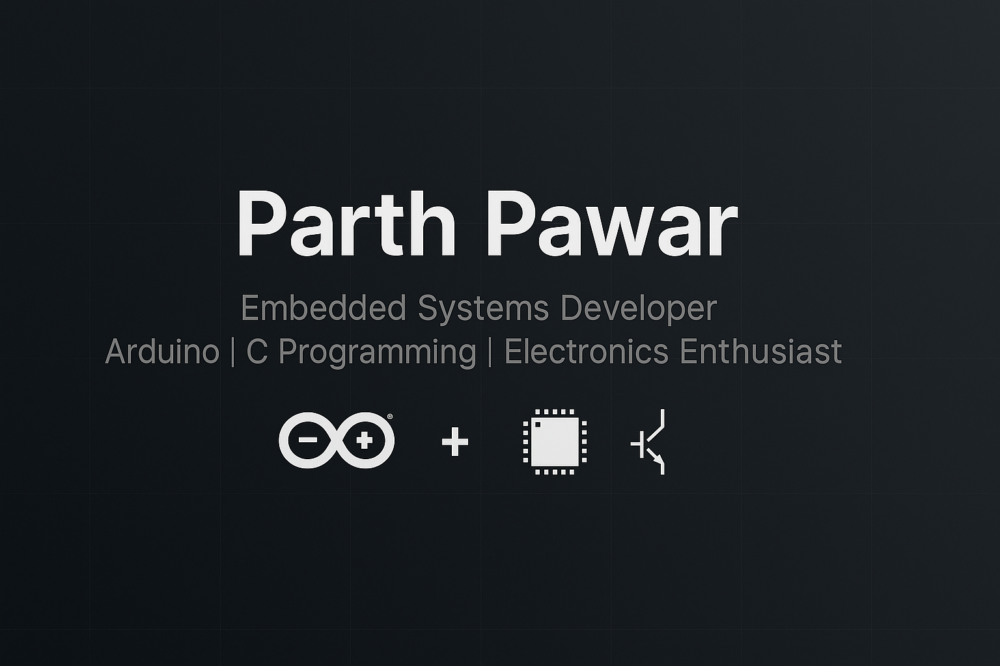

  

# 👋 Hi, I’m Parth Pawar

### 🚀 Embedded Systems | Arduino | C Programming | IoT Projects

- 🎓 Final-year Mechatronics Engineering Student  
- 🛠 Hands-on with Arduino, Sensors, Motors, Serial Communication, and Embedded C  
- 💻 Currently building real-world electronics projects using C & Embedded Systems  
- 🌐 Portfolio: [parth-558.github.io](https://parth-558.github.io)  
- 📫 Email: parthpawar808@gmail.com  
- 📍 Location: Maharashtra, India

## 🔗 Connect with Me

